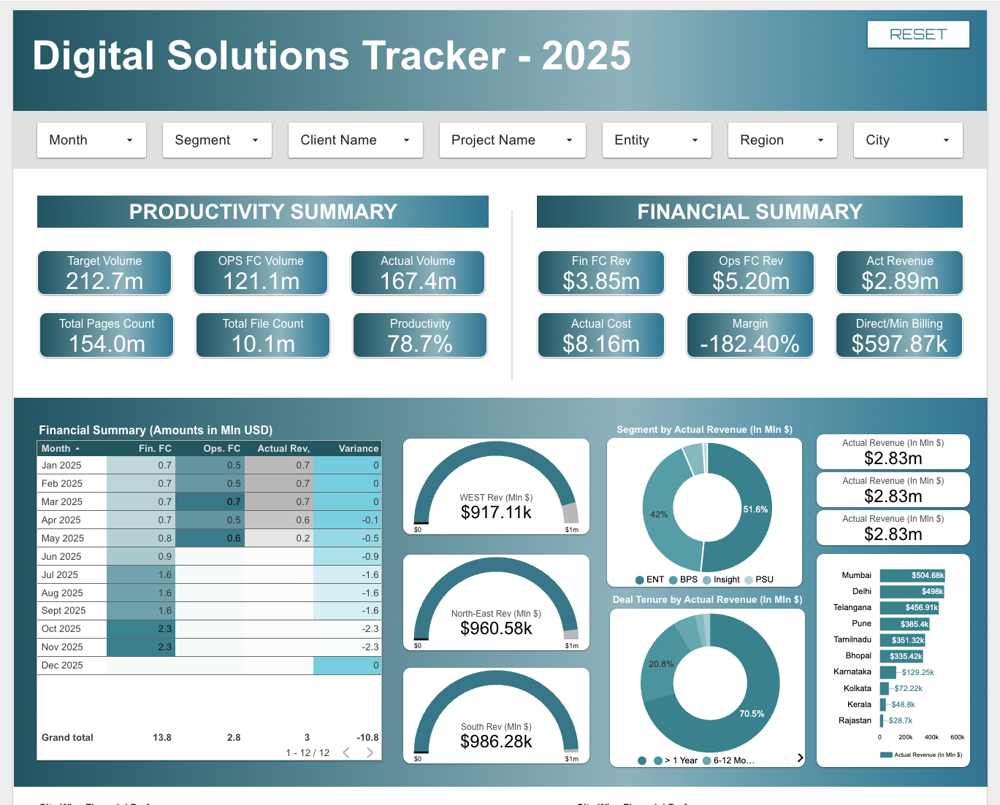

# Digital Solutions – Pan India Tracker (Looker Studio)

Operational and financial performance analysis of Pan-India digital solutions projects using Looker Studio

---

## 📊 Project Overview

This dashboard provides a consolidated view of **Pan-India digital solutions performance for 2025**, designed to track **productivity, revenue realization, forecast variance, and operational efficiency** across projects, regions, cities, and deal tenures.  
Built using **Looker Studio**, the analysis enables stakeholders to identify **revenue leakage, underperforming accounts, and productivity gaps**, supporting data-driven operational and financial decisions.

---

## 🎯 Project Objectives

- Analyze **forecast vs actual performance** across revenue, cost, and volumes  
- Monitor **productivity levels** using target, forecast, and completed volumes  
- Identify **underperforming “Red Accounts”** with low revenue realization  
- Evaluate **regional, city-wise, and segment-wise financial performance**  
- Enable **project-level and tenure-based insights** for operational optimization  

---
## 📸 Dashboard Preview  

## 🔗 Dashboard & Dataset Links

🔗 **Looker Studio Dashboard**  
[Dashboard Link](https://lookerstudio.google.com/reporting/8df445e8-b488-4ded-823e-a085e356bd05)

📂 **Dataset Source**  
[Dataset Link](https://docs.google.com/spreadsheets/d/1OuDvaEJtfvfKjGU9j0n_oitxrRPTxdHGGgjPj9fAA4Y/edit?pli=1&gid=444177763#gid=444177763)

---

## 📌 KPI Questions Answered

- What is the **target volume vs actual volume** and overall productivity?  
- How does **forecasted revenue compare with actual revenue** across months?  
- Which **regions and cities** contribute the highest actual revenue?  
- Which **projects are underperforming** compared to sales forecasts?  
- How does **deal tenure impact productivity and revenue realization**?  
- Where are the **major revenue leakages and negative margins** occurring?  

---

## 📈 Key Metrics & Calculations

- **Productivity %** = (Actual Volume ÷ Target Volume) × 100  
- **Revenue Variance** = Actual Revenue − Forecast Revenue  
- **Margin %** = (Actual Revenue − Actual Cost) ÷ Actual Revenue  
- **Segment Revenue Contribution** (ENT, BPS, PSU)  
- **Deal Tenure Performance** (>1 Year, 6–12 Months, 3–6 Months, etc.)

---

## 💡 Key Insights

- Overall productivity stands at **~78%**, indicating volume shortfall against targets  
- **Negative margin (~-182%)** highlights significant cost overruns and revenue leakage  
- **Mumbai, Delhi, and Telangana** emerge as top revenue-contributing cities  
- Long-term deals (**>1 year tenure**) generate the highest and most stable revenue  
- Multiple projects classified as **“Red Accounts”** with <25% revenue realization  

---

## 🧾 Conclusion

This dashboard delivers a **comprehensive operational and financial snapshot** of digital solutions projects across India. By integrating productivity metrics with forecast vs actual financial analysis, it empowers leadership to **identify inefficiencies, mitigate revenue risks, and prioritize corrective actions** through interactive drill-downs.

---

## 🛠 Tools Used

- **Looker Studio** – Dashboard design and visualization  
- **Excel & Power Query** – Data cleaning and transformation  
- **SQL** – Aggregations and structured data analysis  
- **Salesforce** – Source system  
- **O’Neil** – Operational reporting source  

